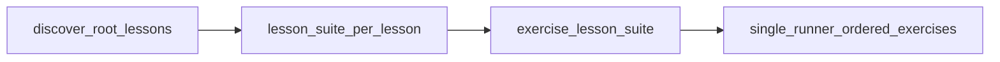

# Teacher guide — progress reports and extending the course

This repository uses **co-located Bash tests** (`exercises/**/<exercise>/test.sh`), an aggregator (`scripts/run-all-tests.sh`), and **Markdown + JSON reports** suitable for archives or a future dashboard—no web application.

## Where progress data appears

Every CI run (and every successful local `scripts/run-all-tests.sh`) produces:

| Output | Purpose |
| --- | --- |
| `reports/progress-report.md` | Printable/email-friendly Markdown tables |
| `reports/progress.json` | Machine-readable summary + `dashboard_rows` |
| `reports/.last-run.ndjson` | One JSON record per exercise (intermediate; handy for debugging) |

These paths are listed in `.gitignore` so students do not accidentally commit scores; **`reports/.gitkeep`** preserves the folder in Git.

### Downloading reports from GitHub Actions

1. Open **Actions → Exercise tests**.
2. Select a workflow run for the student’s fork/branch.
3. Download the **`progress-reports`** artifact (contains `progress-report.md` and `progress.json`).
4. Optionally read the generated **job summary** on the run page for a one-line pass/skip/fail overview.

Repeat per student fork (or integrate artifacts into your LMS later using `progress.json`).

## Reading `progress.json`

Top-level fields:

- `student_github_username` — `github.actor` in CI, or `PROGRESS_STUDENT_ID`, or local `whoami`.
- `last_run_utc` — timestamp applied to each row for that run.
- `summary.passed`, `summary.failed`, `summary.skipped`, `summary.graded_total`, `summary.percent`
- `lessons[]` — grouped exercises with messages and paths.
- `dashboard_rows[]` — flat list aligned with the columns you requested: **student, lesson #, exercise #, slug, status, last_run_utc, message, path**.

### Overall percentage

`summary.percent` is `passed / graded_total * 100`, where `graded_total = passed + failed`.

**Skipped** exercises do not count toward the denominator. They are documented, not graded, in CI.

### Exercises that `skip` today

| Location | Reason |
| --- | --- |
| `03-create-user` | Interactive `passwd` / destructive provisioning |
| `04-groups-membership` | Expects pre-seeded accounts and privileged group edits |
| `06-sudoers-safe` | README-only; no `*.sh` deliverable in-repo |
| `05-routing-and-gateway` | Skips automatically if `/usr/sbin/ip` is missing (common on macOS); runs on Ubuntu CI |
| `06-firewall-basics` | Manual UFW inspection by design |

Adjust the corresponding `test.sh` if your class policy differs.

## How tests work

1. **`scripts/run-all-tests.sh`** walks `exercises/<lesson>/<exercise>/` in sorted order.
2. Each **`test.sh`** must print **exactly one machine-readable summary line** to stdout:

   ```
   RESULT pass|fail|skip Human-readable explanation
   ```

3. Shared helpers live in **`scripts/test-lib.sh`** (`emit_result`, placeholder checks, etc.).
4. **Lesson 05** exercises validate **`task.sh`** network summaries; most earlier lessons validate student scripts (`*.sh` excluding `test.sh` / `task.sh`).
5. **`scripts/run-all-tests.sh`** only descends immediate children of **`exercises/`** whose names match **`^[0-9]{2}[[:space:]]`** (two digits, then whitespace). Keep lesson folders under that pattern and avoid unrelated sibling directories at the same level.

## Repository layout

- **`exercises/lab`** is a symlink to **`lab/`** at the repo root so starter scripts using `../../lab/...` resolve correctly from exercise folders. Preserve this symlink when restructuring files.
- Several exercises recreate scratch files under **`lab/`** (permissions drills, awk samples, backups). Matching paths are **`gitignore`d** so local runs do not clutter `git status`.

## Branch policy (maintainers)

- **`main`** is the **unresolved** student template (TODOs / `_____` placeholders). Learners fork or clone from **`main`**; CI on **`main`** is expected to fail until work is finished (aside from deliberate **skip** tests).
- **Do not merge** reference or solution branches into **`main`** for repos handed to students. Keep worked answers on a **separate branch or private fork**, rebasing onto **`main`** whenever the template changes—same pattern as an instructor-only “always-green baseline” branch mentioned under Troubleshooting.

## CI matrix (GitHub Actions)

CI uses **two workflow layers**: the root workflow schedules lessons **sequentially**; each lesson invokes a reusable workflow that runs **every exercise on the same runner** in sorted folder order (one checkout, **`setup.sh`** once, APT archive cache, no inner matrix VMs). Per-exercise **`progress.json`** generation is skipped during the batch (**`SKIP_PROGRESS_REPORT=1`**); **`aggregate_reports`** still builds the full report once.

| Workflow | Role |
| --- | --- |
| **Root:** [`.github/workflows/exercise-tests.yml`](.github/workflows/exercise-tests.yml) | **`discover`** — [`scripts/ci-discover-matrix.sh`](scripts/ci-discover-matrix.sh) with **`CI_DISCOVER_SCOPE=root_lessons`** emits one matrix row per lesson (`^[0-9]{2}[[:space:]]`…). **`lesson_suite`** — sequential outer matrix (`max-parallel: 1`) calling **`exercise-lesson-suite.yml`** with **`lesson_dir`**, **`lesson_job_title`**, **`lesson_matrix_key`** (artifact id). **`aggregate_reports`** merges **`matrix-ndjson-*`** (each lesson artifact holds **multiple NDJSON lines**). **`enforce_success`** gates on **`lesson_suite`**. |
| **Reusable:** [`.github/workflows/exercise-lesson-suite.yml`](.github/workflows/exercise-lesson-suite.yml) | Single job **`exercises_for_lesson`**: restore APT cache if available, install **`tree` / `jq` / `iproute2`**, run **`scripts/setup.sh`** once, then **[`scripts/ci-run-lesson-exercises.sh`](scripts/ci-run-lesson-exercises.sh)** (loops **`RUN_LESSON_DIR` + `RUN_EXERCISE_SLUG`** per slug, merges lines into **`reports/.last-run.ndjson`**). Upload **`matrix-ndjson-<lesson_matrix_key>`**. Logs use **`::group::`** per exercise for readability. |



**Presentation**

- Root **`lesson_suite`** uses **`job_title`** ending with **`· all exercises`** (lesson wave).
- Exercise-level **`job_title`** strings still appear inside **`run-all-tests.sh`** stdout per **`::group::`** block (no separate Actions job per exercise).
- **`lesson_matrix_key`** (e.g. `01__lesson`) prefixes one NDJSON artifact per lesson containing **all** exercise rows for that lesson.

**Concurrency**

- Only **one lesson suite runs at a time** at the root (**`lesson_suite`** **`max-parallel: 1`**).
- **All exercises within that lesson share one runner** and execute **strictly in sorted slug order**.

Artifacts from reusable workflow runs attach to the **same root workflow run**, so aggregation still uses **`download-artifact`** with pattern **`matrix-ndjson-*`**.

**Discovery env**

| Scope | Variables | Matrix rows |
| --- | --- | --- |
| Root lessons | `CI_DISCOVER_SCOPE=root_lessons` | One per lesson folder |
| Lesson exercises | `CI_DISCOVER_SCOPE=lesson_exercises` and **`CI_LESSON_DIR`** | One matrix row per exercise (used by **`scripts/ci-discover-matrix.py`** for tooling); CI lesson suite uses **`ci-run-lesson-exercises.sh`** instead of an inner matrix. |

**Local filtered run** (matches each inner exercise cell):

```bash
RUN_LESSON_DIR='01 — Linux Fundamentals' RUN_EXERCISE_SLUG='03-find' bash scripts/run-all-tests.sh
```

Omit **`RUN_EXERCISE_SLUG`** (with **`RUN_LESSON_DIR`** set) to run **every exercise** in that lesson through **`run-all-tests.sh`** once.

**Local full lesson on one machine** (similar to CI — batch mode skips **`generate-progress-report`** until you run it yourself):

```bash
bash scripts/setup.sh
LESSON_DIR='01 — Linux Fundamentals' bash scripts/ci-run-lesson-exercises.sh
bash scripts/generate-progress-report.sh
```

## Adding a new exercise

1. Create **`exercises/<NN — Lesson>/<mm-slug>/`** with README + starter scripts (keep `_____` placeholders if you want CI to fail until completion).
2. Add **`test.sh`** beside the student scripts.
   - Source `"$REPO_ROOT/scripts/test-lib.sh"`.
   - Call `check_no_placeholders` on every file students must finish.
   - End with `emit_result …` and `exit 0` for **pass/skip**, `exit 1` after **`RESULT fail`** if you want the harness to record failure while still emitting the RESULT line (the aggregator treats `fail` + non-zero exit as failure).

3. Update lesson README counts/hours if you maintain them.

4. Run locally:

   ```bash
   bash scripts/setup.sh
   bash scripts/run-all-tests.sh
   ```

5. Commit and push; **Exercise tests** runs automatically when `exercises/**`, `scripts/**`, or the workflow changes. CI discovers lessons/exercises dynamically (see **CI matrix** above).

## Troubleshooting

- **Empty `reports/.last-run.ndjson` / missing reports** — ensure `jq` is installed; rerun `scripts/run-all-tests.sh`.
- **False fails on student laptops** — remind students that CI is **Ubuntu**; WSL2 or a container reduces drift.
- **Red CI while placeholders remain** — unfinished starters still contain `_____`; see **Branch policy** above. Keep an instructor-only branch or fork when you need an always-green baseline for comparison.
- **Want stricter/softer grading** — edit the exercise’s `test.sh` assertions; avoid changing the `RESULT …` contract without updating `scripts/run-all-tests.sh`.
