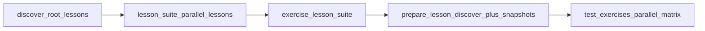

# Teacher guide — progress reports and extending the course

This repository uses **co-located Bash tests** (`exercises/**/<exercise>/test.sh`), an aggregator (`scripts/run-all-tests.sh`), and **Markdown + JSON reports** suitable for archives or a future dashboard—no web application.

## Where grading reports live

These are what instructors (and rubrics) care about:

| Output | Purpose |
| --- | --- |
| `reports/progress-report.md` | Printable/email-friendly Markdown tables |
| `reports/progress.json` | Machine-readable summary + `dashboard_rows` |
| `reports/.last-run.ndjson` | One JSON object per exercise (input for `generate-progress-report.sh`; debugging) |

**Locally:** run **`bash scripts/run-all-tests.sh`** — it clears **`reports/.last-run.ndjson`**, runs tests, then runs **`scripts/generate-progress-report.sh`** unless **`SKIP_PROGRESS_REPORT=1`** is set.

These paths are **`.gitignore`d`** so scores don’t get committed accidentally; **`reports/.gitkeep`** keeps the folder in Git.

### GitHub Actions — download **`progress-reports`** only

On **Actions → Exercise tests →** pick a run → **Artifacts**:

| Artifact name | Use for grading? | What it is |
| --- | --- | --- |
| **`progress-reports`** | **Yes** | **`progress-report.md`** + **`progress.json`** merged across all exercises (`Aggregate progress reports` job). |
| **`ci-lesson-bundle-*`** | **No** | Large internal ZIP (~lab + APT snapshot) so runners share `setup.sh`/`lab/` — **not** your scorecard. Auto-deleted after **3 days**. |
| **`matrix-ndjson-*`** | **No** | Tiny shards consumed only by aggregation — ignore unless debugging CI. |

Steps:

1. Open **Actions → Exercise tests**.
2. Select the run (fork/branch).
3. Download **`progress-reports`** only for grading/archival.
4. Optional: **Aggregate progress reports** job → **Summary** for a short Markdown overview.

Parallel shards upload **`matrix-ndjson-*`**; **`aggregate_reports`** concatenates them (sorted paths), then **`scripts/generate-progress-report.sh`** **`sort_by(.lesson_number, .exercise_number)`**, so ordering does not depend on which exercise job finished first. Combined **`progress.json`** header **`last_run_utc`** is the **latest** shard timestamp.

## Reading `progress.json`

Top-level fields:

- `student_github_username` — `github.actor` in CI, or `PROGRESS_STUDENT_ID`, or local `whoami`.
- `last_run_utc` — header field uses the **latest** shard time after CI merges **`matrix-ndjson-*`** fragments; each **`dashboard_rows`** / **`lessons[].exercises`** entry still has its own timestamp from that exercise run.
- `summary.passed`, `summary.failed`, `summary.skipped`, `summary.graded_total`, `summary.percent`
- `lessons[]` — grouped exercises with messages and paths.
- `dashboard_rows[]` — flat list aligned with the columns you requested: **student, lesson #, exercise #, slug, status, last_run_utc, message, path**.

### Overall percentage

`summary.percent` is `passed / graded_total * 100`, where `graded_total = passed + failed`.

**Skipped** exercises do not count toward the denominator. They are documented, not graded, in CI.

### Exercises that `skip` today

| Location | Reason |
| --- | --- |
| `03-create-user` | Interactive `passwd` / destructive provisioning |
| `04-groups-membership` | Expects pre-seeded accounts and privileged group edits |
| `06-sudoers-safe` | README-only; no `*.sh` deliverable in-repo |
| `05-routing-and-gateway` | Skips automatically if `/usr/sbin/ip` is missing (common on macOS); runs on Ubuntu CI |
| `06-firewall-basics` | Manual UFW inspection by design |

Adjust the corresponding `test.sh` if your class policy differs.

## How tests work

1. **`scripts/run-all-tests.sh`** walks `exercises/<lesson>/<exercise>/` in sorted order.
2. Each **`test.sh`** must print **exactly one machine-readable summary line** to stdout:

   ```
   RESULT pass|fail|skip Human-readable explanation
   ```

3. Shared helpers live in **`scripts/test-lib.sh`** (`emit_result`, placeholder checks, etc.).
4. **Lesson 05** exercises validate **`task.sh`** network summaries; most earlier lessons validate student scripts (`*.sh` excluding `test.sh` / `task.sh`).
5. **`scripts/run-all-tests.sh`** only descends immediate children of **`exercises/`** whose names match **`^[0-9]{2}[[:space:]]`** (two digits, then whitespace). Keep lesson folders under that pattern and avoid unrelated sibling directories at the same level.

## Repository layout

- **`exercises/lab`** is a symlink to **`lab/`** at the repo root so starter scripts using `../../lab/...` resolve correctly from exercise folders. Preserve this symlink when restructuring files.
- Several exercises recreate scratch files under **`lab/`** (permissions drills, awk samples, backups). Matching paths are **`gitignore`d** so local runs do not clutter `git status`.

## Branch policy (maintainers)

- **`main`** is the **unresolved** student template (TODOs / `_____` placeholders). Learners fork or clone from **`main`**; CI on **`main`** is expected to fail until work is finished (aside from deliberate **skip** tests).
- **Do not merge** reference or solution branches into **`main`** for repos handed to students. Keep worked answers on a **separate branch or private fork**, rebasing onto **`main`** whenever the template changes—same pattern as an instructor-only “always-green baseline” branch mentioned under Troubleshooting.

## CI matrix (GitHub Actions)

CI uses **two workflow layers** so each lesson splits into **parallel exercise jobs** (GitHub cannot nest matrices in one file; this uses a **caller + reusable workflow**).

| Workflow | Role |
| --- | --- |
| **Root:** [`.github/workflows/exercise-tests.yml`](.github/workflows/exercise-tests.yml) | **`discover`** — [`scripts/ci-discover-matrix.sh`](scripts/ci-discover-matrix.sh) with **`CI_DISCOVER_SCOPE=root_lessons`** emits one matrix row per lesson (`^[0-9]{2}[[:space:]]`…). **`lesson_suite`** — outer matrix runs **one reusable workflow per lesson in parallel** (no **`max-parallel`** cap), passing **`lesson_dir`**, **`lesson_job_title`**, and **`lesson_cache_key`** (`matrix.key`, e.g. `01__lesson`). **`aggregate_reports`** / **`enforce_success`** unchanged. |
| **Reusable:** [`.github/workflows/exercise-lesson-suite.yml`](.github/workflows/exercise-lesson-suite.yml) | **`prepare_lesson`** — discovers exercises (**`lesson_exercises`** scope), restores/caches **`.deb`** files via **`actions/cache`** on workspace dir **`.ci-apt-archives`** (mirrored to **`/var/cache/apt/archives`** — system path is not cached directly because `tar` cannot archive root-owned dirs reliably), runs **`sudo apt-get update`** + installs from **[`.github/ci-apt-packages.txt`](.github/ci-apt-packages.txt)**, runs **`scripts/setup.sh` once**, packs **`lab/`**, snapshots APT into **`ci-apt-snapshot.tgz`**, uploads **`ci-lesson-bundle-<lesson_cache_key>`** (short retention). **`test_exercises`** — parallel matrix jobs restore bundle + APT, run **`SKIP_PROGRESS_REPORT=1`** **`run-all-tests.sh`**, upload **`matrix-ndjson-*`**. |



**Presentation**

- Root **`lesson_suite`** uses **`job_title`** ending with **`· all exercises`** (lesson wave).
- Inner **`test_exercises`** uses **`›`** plus the exercise folder name after the trimmed lesson title (same **`job_title`** rules as before).
- **`key`** is ASCII-safe for artifact names only (`matrix-ndjson-…`).

**Concurrency**

- **Lesson suites** can run **in parallel** at the root (no **`max-parallel`** cap); GitHub queues only when your account hits concurrency limits.
- **Exercise jobs** inside each lesson suite run **in parallel** by default (same caveat).

Combined **`progress.json`** / NDJSON merge order follows **`find … \| LC_ALL=C sort`** in **`aggregate_reports`**, not job completion order.

**Discovery env**

| Scope | Variables | Matrix rows |
| --- | --- | --- |
| Root lessons | `CI_DISCOVER_SCOPE=root_lessons` | One per lesson folder |
| Lesson exercises | `CI_DISCOVER_SCOPE=lesson_exercises` and **`CI_LESSON_DIR`** | One per exercise subfolder under that lesson |

**Local filtered run** (matches each inner exercise cell):

```bash
RUN_LESSON_DIR='01 — Linux Fundamentals' RUN_EXERCISE_SLUG='03-find' bash scripts/run-all-tests.sh
```

Omit **`RUN_EXERCISE_SLUG`** to execute every exercise under that lesson.

## Adding a new exercise

1. Create **`exercises/<NN — Lesson>/<mm-slug>/`** with README + starter scripts (keep `_____` placeholders if you want CI to fail until completion).
2. Add **`test.sh`** beside the student scripts.
   - Source `"$REPO_ROOT/scripts/test-lib.sh"`.
   - Call `check_no_placeholders` on every file students must finish.
   - End with `emit_result …` and `exit 0` for **pass/skip**, `exit 1` after **`RESULT fail`** if you want the harness to record failure while still emitting the RESULT line (the aggregator treats `fail` + non-zero exit as failure).

3. Update lesson README counts/hours if you maintain them.

4. Run locally:

   ```bash
   bash scripts/setup.sh
   bash scripts/run-all-tests.sh
   ```

5. Commit and push; **Exercise tests** runs automatically when `exercises/**`, `scripts/**`, or the workflow changes. CI discovers lessons/exercises dynamically (see **CI matrix** above).

## Troubleshooting

- **Empty `reports/.last-run.ndjson` / missing reports** — ensure `jq` is installed; rerun `scripts/run-all-tests.sh`.
- **False fails on student laptops** — remind students that CI is **Ubuntu**; WSL2 or a container reduces drift.
- **Red CI while placeholders remain** — unfinished starters still contain `_____`; see **Branch policy** above. Keep an instructor-only branch or fork when you need an always-green baseline for comparison.
- **Want stricter/softer grading** — edit the exercise’s `test.sh` assertions; avoid changing the `RESULT …` contract without updating `scripts/run-all-tests.sh`.
